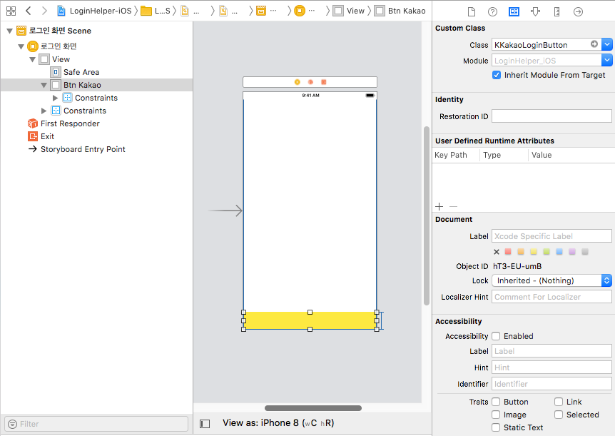

# LoginHelperForKakao-iOS
Kakao Talk 회원가입의 편리성을 위해 만들어진 Login Helper 입니다.

<br/>

# KAKAO LOGIN

카카오 로그인을 보다 간편하게 만들 수 있도록 구성하였습니다.

## 필요사항

1. [카카오 앱 생성](https://developers.kakao.com/docs/ios/getting-started#앱-생성)
2. *KAKAO_APP_KEY* Xcode 프로젝트에 등록

## 사용 방법

1. 카카오 버튼을 표시할 `UIView` 의 Class Name을 `DEOKakaoLoginButton` 로 변경합니다.
   

2. `actionSigninButton()` 을 호출 하여 로그인한 카카오 계정 정보를 업데이트 합니다.

```swift
@IBOutlet weak var btnKakao: DEOKakaoLoginButton!
@IBAction func kakoAction(_ sender: Any) {
    btnKakao.actionSigninButton(view: self, completion: {(profile, error) -> Void in
             if(error != nil){
                print("error : \(error!)")
                return
              }
              DispatchQueue.main.async(execute: { () -> Void in                                                                            					 print("Kakao Email = \(String(describing: profile!.email))")
                  if let nickName = profile!.property(forKey: KOUserNicknamePropertyKey) as? String{
                       print("Kakao Nick Name = \(nickName)")
                  }
                  if let profileImage = profile!.property(forKey: KOUserProfileImagePropertyKey) as? String{
                      print("Kakao Profile Image = \(profileImage)")
                  }
   	})
}
```

